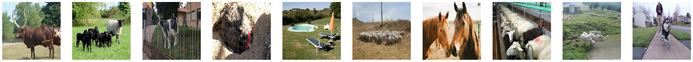
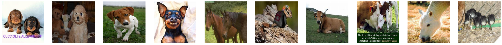

## Deep Learning

**```Definição```**: é uma sub-área da Aprendizagem de Máquina que emprega camadas de neurônios matemáticos para processar dados, compreender a fala humana e reconhecer objetos visualmente. A informação é passada através de cada camada, com a saída da camada anterior fornecendo entrada para a próxima camada. São uma grande revolução para Inteligência Artificial e aprenderemos sobre esse tópico

## Principais aplicações

**```1. Reconhecimento facial com CNNs```**

Técnica amplamente utilizada para identificar indivíduos com base em suas características faciais, sendo aplicada em diversas áreas, como segurança, biometria, saúde, educação.

Uma abordagem comum para realizar o reconhecimento facial é por meio do uso de redes neurais convolucionais (CNNs) que são particularmente eficazes na identificação de padrões em imagens. No processo de reconhecimento facial com CNNs, a rede é treinada para aprender a identificar características únicas do rosto de uma pessoa, como a forma do rosto, a posição dos olhos, boca e nariz, bem como as linhas da pele. Após o treinamento da CNN, ela se torna capaz de identificar indivíduos ao comparar as características faciais presentes em uma imagem com as características aprendidas durante o treinamento. Essa comparação é fundamental para a capacidade da rede em reconhecer e distinguir diferentes pessoas. Além disso, as CNNs extraem automaticamente características hierárquicas das imagens, passando de bordas e texturas simples em camadas iniciais para características faciais mais complexas em camadas mais profundas.

O treinamento da CNN ocorre de maneira supervisionada, utilizando pares de imagens e rótulos correspondentes durante o processo. O resultado final desse processo é um vetor de características conhecido como _embedding facial_, que representa de forma compacta as características essenciais da face e é utilizado para comparações.

O reconhecimento facial enfrenta alguns desafios, como a necessidade de conjuntos de dados extensos para treinamento, considerações éticas relacionadas à privacidade e questões de viés étnico. No entanto, suas aplicações vão além da segurança, abrangendo autenticação, organização de fotos e entretenimento em redes sociais.

A pesquisa contínua busca aprimorar o reconhecimento facial, explorando arquiteturas avançadas, técnicas de aumento de dados e considerações éticas para garantir uma aplicação mais precisa, robusta e ética dessa tecnologia em constante evolução.


**```2. Reconhecimento de voz com RNNs```**

A técnica de reconhecimento de voz viabiliza a identificação de palavras por meio da voz humana, encontrando aplicação em diversas áreas, como tradutores automáticos, assistentes virtuais, reconhecimento de falas, segurança, acessibilidade, dentre outras.

Para realizar o reconhecimento de voz, uma abordagem comum é empregar redes neurais recorrentes (RNNs),que são especializadas na identificação de padrões em sequências de dados.

No contexto do reconhecimento de voz, as RNNs desempenham o papel de aprender a discernir as características específicas da fala associadas a cada palavra, onde essas características englobam a frequência e a duração dos sons emitidos e a ordem em que eles ocorrem. Após o treinamento da RNN, ela se torna apta a identificar palavras o que é feito por meio da comparação entre as sequências de sons de entrada e aquelas que a rede neural absorveu durante o treinamento.

O reconhecimento de voz com o uso de RNNs destaca-se por sua precisão e tem demonstrado eficácia em diversas aplicações. A habilidade dessas redes neurais em compreender a estrutura sequencial das informações sonoras as torna uma escolha robusta para lidar com a complexidade da fala humana em variados contextos e cenários.

**```3. Produção de textos com LSTMs```**

É uma técnica que viabiliza a produção de conteúdo textual inédito e original, sendo aplicada em diversas situações, como na geração de conteúdo, tradução automática, automação de respostas, marketing digital, dentre outras.

Um método comum para realizar a geração de texto é empregar redes neurais de memória de longo prazo (LSTMs). As LSTMs, são tipos de redes neurais recorrentes e destacam-se por sua habilidade em reter informações ao longo de períodos extensos.

No contexto da geração de texto, as LSTMs são empregadas para aprender a sequência de caracteres mais provável de ocorrer em seguida. Esse processo envolve a consideração da sequência de caracteres anterior e das informações previamente adquiridas pela LSTM. Após o treinamento da LSTM, ela torna-se apta a gerar texto inédito que é alcançado gerando um caractere de cada vez, levando em conta a sequência de caracteres precedente e as informações previamente aprendidas.

## Principais desafios e limitações

1) A necessidade de grandes volumes de dados para treinamento é uma tarefa árdua para que se alcançe um modelo de desempenho bem comportado, ou seja, à medida que os dados aumentam, um modelo de desempenho extra bem comportado pode ser alcançado;

2) O desbalanceamento de dados pode influenciar diretamente na capacidade de generalização para todas as classes e gerar vieses indesejados em direção às classes majoritárias;

3) As técnicas de DL são verdadeiras "caixas-pretas", tornando difícil entender como as decisões do modelo são tomadas e explicá-las para a partes interessadas;

4) Obter escores de confiança para previsões do modelo;

5) A introdução de novas informações pode levar ao esquecimento de informações aprendidas anteriormente;

6) A falta de restrições suficientes ou informações para definir uma solução única e inequívoca. Essa questão é particularmente evidente quando os modelos de ML mostram comportamentos inesperados ou baixos desempenhos em casos de teste do mundo real, apesar de terem sido treinados e avaliados em conjuntos de dados reais.

**```Possíveis soluções```**: utilização da transferência de aprendizado após a coleta de dados de tarefas semelhantes, aumento de dados, como tradução, espelhamento e rotação de imagens; utilização de perda ponderada de **```cross entropy```** para equilibrar o desempenho em classes pequenas e grandes; uso de técnicas baseadas em **```backpropagation```** e perturbação para interpretar o modelo; ajustar as saídas **```softmax```** para obter _scores_ de probabilidade confiáveis; aprendizado com memória dupla para lidar com o esquecimento catastrófico; aplicar "testes de resistência" para examinar até que ponto um modelo funciona bem em dados do mundo real e para descobrir os possíveis problemas. 


## Descrição do problema 

Vou adotar o modelo **```ResNet-50```** para extrair características de imagens de animais e assim clusterizar os vetores obtidos usando o algoritmo **```K-Means```**. 


## Modelo 

A ResNet50 é uma rede neural convolucional (CNN) com 50 camadas profundas que foi projetada para tarefas de visão computacional, como reconhecimento de imagens, detecção de objetos e segmentação de imagens. É importante lembrar que a ResNet pertence a família das redes residuais, ou seja, cada bloco de camadas inclui um "atalho" ou uma conexão de salto que adiciona a entrada original do bloco à saída do bloco. Essa conexão de atalho permite que a rede aprenda a diferença, ou "resíduo", entre a entrada e a saída do bloco, em vez de tentar aprender a mapear diretamente a entrada para a saída.

Finalmente as imagens obtidas serão mostradas em **```10 clusters```**, um para cada espécie de animal.

## Clusterização - ```K-Means```
**```Cluster 1```**


**```Cluster 2```**


**```Cluster 3```**


**```Cluster 4```**



**```Cluster 5```**


**```Cluster 6```**


**```Cluster 7```**


**```Cluster 8```**



**```Cluster 9```**


**```Cluster 10```**


## Métricas utilizadas: 
### ```Índice de Rand ajustado, Homogeneidade, Completude e V-measure``` 

O **```Índice de Rand ajustado```** é importante para avaliar a qualidade da clusterização, ou seja, a organização de dados em grupos distintos - ele mede a similaridade entre a clusterização predita pelo modelo e a clusterização real.

A **```Homogeneidade, Completude e V-Measure```** medem diferentes aspectos da qualidade dos clusters, como a pureza dos clusters (homogeneidade), a quantidade de instâncias de cada classe que estão agrupadas juntas (completude) e a média harmônica dessas duas métricas (V-Measure).


## Análise dos resultados

  ***
  ÍNDICE DE RAND AJUSTADO: 0.6288540446004253

  ***
  HOMOGENEIDADE: 0.7168401790115778

  ***
  COMPLETUDE: 0.7309919902009214

  ***
  V-MEASURE: 0.7238469212860121
  ***


Quanto mais próximo de 1 estão as métricas descritas, melhor é o desempenho da clusterização de acordo com a proposta de cada métrica. Vemos que os resultados apresentados são razoáveis, tendo em vista que algumas imagens não condizem com o cluster que ela está alocada. As imagens dentro de cada classe podem ter uma grande variabilidade, tornando-as mais difíceis de serem agrupadas corretamente no devido cluster. Isso pode ocorrer se as imagens dentro de uma classe tiverem diferentes poses, fundos, iluminações, semelhança nas características, etc. Podemos observar isso nos **```clusters 4, 7, 8 e 10```** onde alguma das características citadas estão dificultando o algoritmo em agrupá-la em seu devido cluster.

                      


