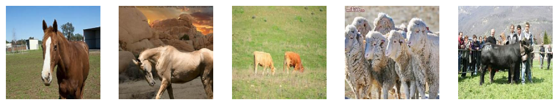

## Relatório final

Métricas para a matriz de confusão:

``` python 

Acurácia: 77.92%
Precisão: 81.03%
Revocação: 77.92%
F1-Score: 78.10%

```
Em geral os resultados são satisfatórios. 

Podemos observar que algumas imagens não condizem com o cluster que ela está alocada, pois aparentemente não foram classificadas somente pela espécie do animal, mas também pela posição que ele está na foto. Isso pode ser observado em alguns clusters, como por exemplo nos ```clusters 4, 7, 8 e 10``` onde os animais estão posicionados de lado ou de frente, veja nas imagens abaixo.





